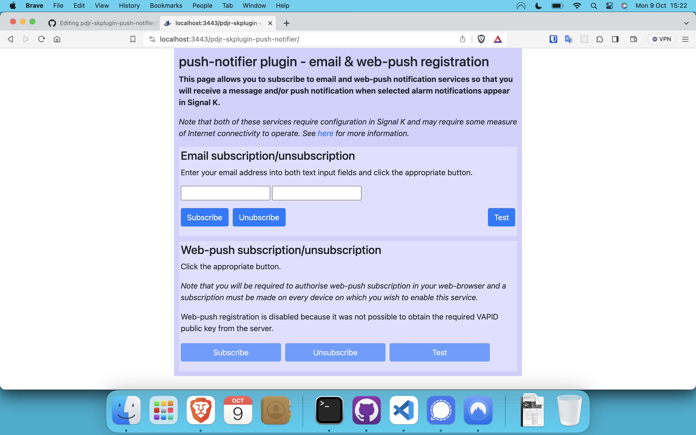

# pdjr-skplugin-push-notifier

Forward Signal K notifications over email and web-push.

## Description

**pdjr-skplugin-push-notifier** forwards Signal K notifications using
either email or web-push and to be in any way useful requires an
operating environment that supports at least intermittent Internet
connectivity.

Email forwarding requires that the Signal K server has access to an
SMTP mail submssion agent (MSA).
The plugin uses
[nodemailer](https://nodemailer.com/)
as its mail user agent (MUA) and so works happily with most popular
Internet mail services.

Web-push notification requires that the host Signal K server runs with SSL
security enabled and both server and clients must have appropriate X.509
keys either signed and distributed by a trusted authority or (more likely
on a private LAN) self-signed and manually distributed.

Signal K users can subscribe to and unsubscribe from push services using
the plugin's Webapp.



The plugin is configured by specifying Signal K paths that should be
monitored for notification events and notification methods that
should trigger the issuing of an email message and/or a web-push
notification.

A simple retrieval mechanism allows Signal K paths to be retrieved
from third party applications or plugins which expose an appropriate HTTP
API method.
This can be used to integrate the plugin's push services with, for example,
the actions of an alarm notifier.

The plugin exposes an
[HTTP API](https://pdjr-signalk.github.io/pdjr-skplugin-push-notifier/)
and contributes OpenAPI documentation of its interface to the Signal
K OpenAPI service.

## Configuration

<dl>
  <dt>Signal K credentials (<code>credentials</code>)</dt>
  <dd>
    <p>
    Enter a string of the form <em>username</em>:<em>password</em>
    providing credentials that will allow the plugin to access the API
    method of another Signal K service over HTTP.
    </p>
    <p>
    You can use the credentials of an existing Signal K user, but you may
    want to create a new user for the exclusive use by the plugin.
    </p>
    <p>
    This property must be supplied.
    </p>
  </dd>
  <dt>Monitor these paths (<code>paths</code>)</dt>
  <dd>
    <p>
    Enter a list of items which define the Signal K notification paths that
    the plugin should monitor.
    </p>
    <p>
    Each item in the list can be:
    <ul>
      <li>
        a Signal K path (for example <code>tanks.wasteWater.0.currentLevel</code>)
        which should be monitored for notifications;
      </li>
      <li>
        a URL specifying an API method that returns a list of Signal K paths
        (for example <code>https://localhost:3443/plugins/alarm-manager/keys</code>).
      </li>
      <li>
        a Signal K path of the form 'restart:<em>path</em>' (for example
        <code>restart:notifications.plugins.alarm-manager.keyChange</code>).
        A value change on this path will restart the plugin.
      </li>
    </ul>
    </p>
    <p>
    This property must be supplied.
    </p>
  </dd>
  <dt>Subscriber database (<code>subscriberDatabase</code>)</dt>
  <dd>
    <p>
    This optional property defines the Signal K resources provider that
    will be used to store email and web-push subscriptions.
    </p>
    <p>
    If you omit this property a default value will be used that selects
    the Signal K built-in resources provider (<code>resources-provider</code>)
    and the resource type <code>push-notifier</code>.
    </p>
    <p>
    You must create a custom resource type in the specified resource
    provider configuration that matches the resource type name expected
    by this plugin.
    <dl>
      <dt>Resources provider <code>resourcesProvider</code></dt>
      <dd>
        <p>
        The name of the Signal K resources provider that will be
        used to persist subscriber data.
        </p>
      </dd>
      <dt>Resource type <code>resourceType</code></dt>
      <dd>
        <p>
        The name of the resource type under which subscriber data will
        be stored.
        </p>
      </dd>
    </dl>
  </dd>
  <dt>Services <code>services</code></dt>
  <dd>
    <p>
    This required property supplies configuration data for the email
    and web-push services and, for the plugin to do anything, at least
    one of these configurations must be supplied.
    </p>
    <dl>
      <dt>Email <code>email</code></dt>
      <dd>
        <p>
        Optional property supplying configuration data for the email
        service.
        </p>
        <p>
        The plugin uses
        [nodemailer](https://nodemailer.com/)
        as its mail user agent and some of the supplied configuration
        data must be supplied in a format acceptable to this module.
        </p>
        <dl>
          <dt>Methods <code>methods</code></dt>
          <dd>
            <p>
            Required property supplying a comma-separated list of
            Signal K notification methods which should trigger the
            output of a push notification all users subscribed to the
            email service.
            </p>
            <p>
            Signal K defines 'visual' and 'sound' as default methods,
            but plugins which create notifications can extend this
            range.
            See, for example,
            <a href="https://github.com/pdjr-signalk/pdjr-skplugin-alarm-manager">pdjr-skplugin-alarm-manager</a>.
            </p>
          </dd>
          <dt>Nodemailer transport options <code>transportOptions</code></dt>
          <dd>
            <p>
            String containing a JSON encoded object that will be passed
            directly to <code>nodemailer.createTransport()</code>
            in order to establish a connection to your SMTP mail
            host.
            </p>
          </dd> 
          <dt>Nodemailer message options <code>messageOptions</code></dt>
          <dd>
            <p>
            String containing a JSON encoded object that will be merged
            with the options generated by the plugin (i.e. "subject",
            "body" and "to") before the result is passed to
            <code>nodemailer.transporter.sendMail()</code>.
            This is most useful for specifying the 'from' address to
            be used in outgoing messages.
            </p>
          </dd>
        </dl>
      </dd>
      <dt>Web push <code>webpush</code></dt>
      <dd>
        <p>
        Optional property supplying configuration data for the web-push
        service.
        </p>
        <p>
        VAPID keys are required by the push notification protocols.
        These can be easily
        <a href="https://iamstepaul.hashnode.dev/generating-a-secure-vapid-key-for-a-nodejs-project#heading-using-the-comand-line">obtained from the command line</a>
        and the returned values must be made available through either
        the ```transportOptions.vapid``` property or by assigning them
        to the environment variables VAPID_PRIVATE_KEY, VAPID_PUBLIC_KEY
        and VAPID_SUBJECT from where the plugin can retrieve them.
        </p>
        <dl>
          <dt>Methods <code>methods</code></dt>
          <dd>
            <p>
            Required property supplying a comma-separated list of
            Signal K notification methods which should trigger the
            output of a web-push notification to users subscribed to
            the web-push service.
            </p>
            <p>
            Signal K defines 'visual' and 'sound' as default methods,
            but plugins which create notifications can extend this
            range.
            See, for example,
            <a href="https://github.com/pdjr-signalk/pdjr-skplugin-alarm-manager">pdjr-skplugin-alarm-manager</a>.
            </p>
          </dd>
          <dt>Web-push transport options <code>transportOptions</code></dt>
          <dd>
            <p>
            Optional string containing a JSON encoded object containing
            a 'vapid' object with string properties 'privateKey',
            'publicKey' and 'subject'.
            </p>
            <p>
            If omitted, the the plugin will attempt to recover VAPID
            data from the environment variables
            <code>VAPID_PUBLIC_KEY</code>,
            <code>VAPID_PRIVATE_KEY</code> and
            <code>VAPID_SUBJECT</code>.
            </p>
          </dd>
        </dl>
      </dd>
    </dl>
  </dd>
</dl>

### Configuration example

I use the plugin exclusively for forwarding email notifications raised
by my alarm manager and my ```push-notifier.json``` configuration file
looks like this.
```
{
  "configuration": {
    "credentials": "push-notifier:password",
    "paths": [
      "https://localhost:3443/plugins/alarm-manager/keys",
      "restart:notifications.plugins.alarm-manager.keyChange"
    ],
    "services": {
      "email": {
        "methods": "push",
        "transportOptions": "{ \"host\": \"smtp.mail.server\", \"port\": 587, \"secure\": false, \"auth\": { \"user\": \"someone@mydomain\", \"pass\": \"mypassword\" }, \"tls\": { \"ciphers\": \"SSLv3\" } }",
        "messageOptions": "{ \"from\": \"noreply@mydomain\" }"
      },
      "webpush": {
        "methods": "push"
      }
    }
  },
  "enabled": true,
  "enableDebug": false
}

```
I keep my VAPID keys in environment variables and the absence of a
```services.webpush.transportOptions``` property forces the plugin to
recover its VAPID data from the host environment.

The absence of a ```subscriberDatabase``` property forces the plugin to
use Signal K's default ```resources-provider``` plugin and the default
resource type ```push-notifier```.

### Configuring the host environment

1. Create a persistent data store where the plugin can save push
   notification subscriptions by configuring Signal K's 'Resources
   Provider (built-in)' plugin to support the 'push-notifier' custom
   resource type.

2. Recommended. Create a Signal K user with the username 'push-notifier'
   and some password.
   Make sure that the values you choose correspond to the values
   specified in the plugin configuration 'credentials' property.

#### Configuring email use

1. Create a transport configuration object for
   [nodemailer](https://nodemailer.com/) that allows you to connect
   to your mail submission agent.

2. Convert the object you create at (1) into a JSON string and
   save the string as the value of the ```transmissionObject```
   property in the plugin configuration.

You should now be able to viisit the plugin's webapp and be able
to subscribe and test email notification.

#### Configuring wep-push notification use

1. Create VAPID keys required by the push notification protocol.
   ```
   $> npm install -g web-push
   $> web-push generate-vapid-keys
   ```

2. Make VAPID keys available in the Signal K execution environment
   by using a text editor to add the following lines to the beginning
   of the ```signalk-server``` start script.
   ```
   export VAPID_PUBLIC_KEY=*public key*
   export VAPID_PRIVATE_KEY=*private key*
   export VAPID_SUBJECT=mailto:*some email address*
   ```

3. 


4. Configure Signal K to operate using SSL (if it isn't already) by
   running 'signalk-server-setup' and entering 'y' in response to the
   'Do you want to enable SSL?' prompt.
5. Enable the plugin's push notification service by checking the
   'Enable push notifications' property in the plugin configuration
   screen.

At this point the plugin will be able to manage subscriptions to its
push notification service and will attept to send push notifications
to subscribers when alarm conditions arise in Signal K.
In the unlikely circumstance that your Signal K server has an SSL
certificate issued by an authoritative provider then nothing more needs
to be done.

Mostly though, our Signal K servers operate on a private LAN and we
need to provide an SSL infastructure that will allow the required push
notification protocols to operate.
There are a number of ways to achieve this, but I use the simple
expedient of installing self-signed SSL certificates on the Signal K
server and client devices.
This is a little clunky since client certificates have to be manually
installed and authorised on each push notification client.
The details of this procedure differ across operating systems and
browsers.

6. Generate SSL keys by executing the following commands.
   ```
   $> cd ~ ; mkdir ssl ; cd ssl
   $> # Generate 

   ```
7. Install server keys in Signal K.

8. Install client key on a Macbook Air

9. Install client key on an Android phone using Brave

Without SSL this feature is only accessible from the Signal K server
host, but in the circumstance that you have a UI and web-browser
on the same device as your Signal server then you can check that things
are working by opening the plugin's Webapp, clicking the 'Subscribe'
button and allowing notifications from 'localhost' in the ensuing,
browser-generated, dialogue.
Once subscribed, if you then click the 'Test' button you should
receive a push notification confirming that the plugin is able
to communicate with a trusted peer.
Repeating this procedure from a device other than the Signal K
server will fail because the Signal K server and client are unable
to authenticate one-another using SSL.

## Operating principle

The plugin monitors all selected keys in the Signal K tree which have
an associated metadata object that contains a 'zones' property and
which are therefore able to support alarm function.

The plugin waits for values to appear on each key and checks these
against the associated metadata alarm zones configuration: if the key
value falls within an alarm zone then a notification will be issued on
the path 'notifications.*key*' using the rules defined in the *key*'s
metadata zones property.

Each time a notification is issued the alarm digest and any specified
output channel states are updated.

## Author

Paul Reeve <*preeve_at_pdjr_dot_eu*>
